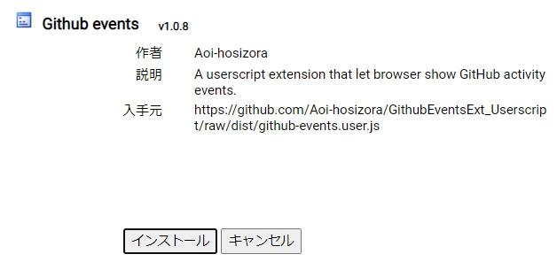

# GithubEventsExt_Userscript

+ A Userscript extension that shows GitHub activity events in sidebar and improves several UI details.
+ For Chrome version, please visit [Aoi-hosizora/GithubEventsExt](https://github.com/Aoi-hosizora/GithubEventsExt).

### Features

+ [x] Show repo, user and org events in human readable format in sidebar.
+ [x] Improve several GitHub UI details.

### Install

1. Install `Tampermonkey` / `Greasemonkey` extension for your browser (Chrome, Edge, Firefox, etc).
2. Visit https://github.com/Aoi-hosizora/GithubEventsExt_Userscript/raw/dist/github-events.user.js, this code is built by GitHub Actions.
3. Click the "Install" button to install the extension. Now you will see the effect after refresh the GitHub page.

    

### Screenshots

    
    

### License

+ GithubEventsExt is a free and open-source software, and is released under the **MIT License**.
+ Copyright (c) 2020-2023 [AoiHosizora (青いほしぞら)](https://github.com/Aoi-hosizora). Visit [LICENSE](./LICENSE) for details.

### Acknowledgements

+ GithubEventsExt is supported by [JetBrains Free License Programs](https://www.jetbrains.com/community/opensource/#support). [JetBrains](https://www.jetbrains.com/) provides us a free open-source development license for this open-source project.

### References

+ [Tampermonkey中文文档（部分）](https://blog.csdn.net/abc45628/article/details/53919135)
+ [Tampermonkey documentation](https://www.tampermonkey.net/documentation.php)
+ [GM_addStyle equivalent in TamperMonkey](https://stackoverflow.com/questions/23683439/gm-addstyle-equivalent-in-tampermonkey)
+ [tobyqin/tampermonkey_vue](https://github.com/tobyqin/tampermonkey_vue)
+ [TypeScript でユーザースクリプトを書いた](http://kotas.hatenablog.jp/entry/2013/10/27/212037)
+ [TheDavidDelta/scope-extensions-js](https://github.com/TheDavidDelta/scope-extensions-js)
